# REPORT

This document contains a brief of how the following activities have been accomplished:

- The two services `accounts (2222)` and `web` are running and registered (two terminals, logs screenshots).
- The service registration service has these two services registered (a third terminal, dashboard screenshots)
- A second `accounts` service instance is started and will use the port 4444. This second `accounts (4444)` is also
  registered (a fourth terminal, log screenshots).
- What happens when you kill the service `accounts (2222)` and do requests to `web`?  
  Can the web service provide information about the accounts again? Why?

## Steps
The first task we are going to do is to start de registration application. It will lunch the discovery service Eureka using the port 1111. If we access to this application on the navigator by the order ‘localhost:1111’, this is what we see:

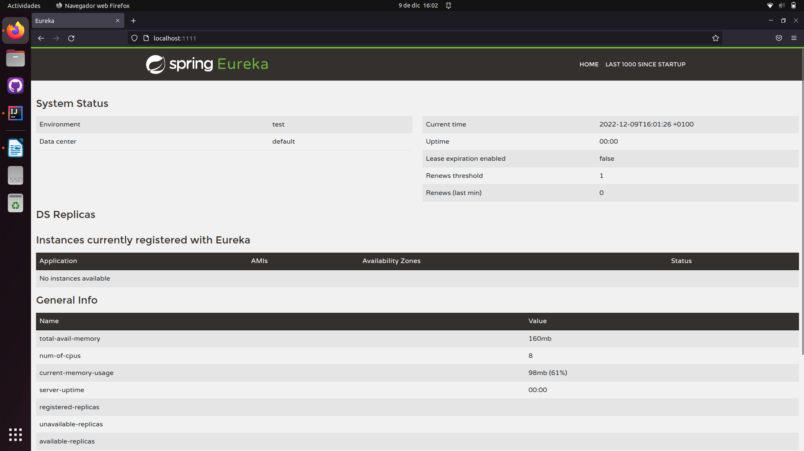

After that, we are going to launch the account service, which is a backend application that provides a RESTful server to a repository of accounts that uses the port 2222. It is such an Eurika client with an account store. When we launch this application, it generates a database. We can see on the logs that this application tells us who has get registered, its namen the IP that is using, etc.

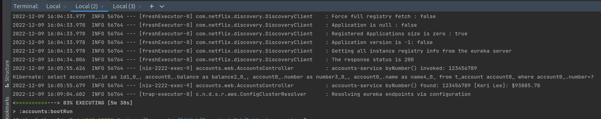

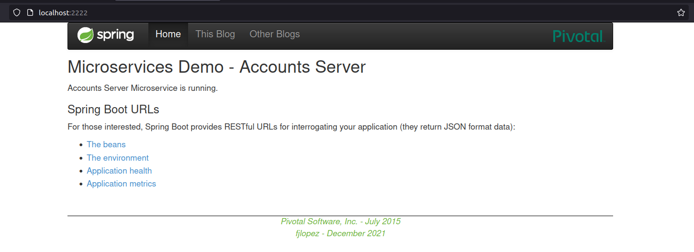

Next, we have to launch the third application, the web one, which works at port 3333. It is an Eurika client and defines a web server.

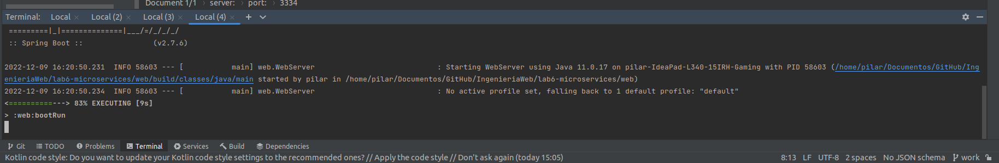

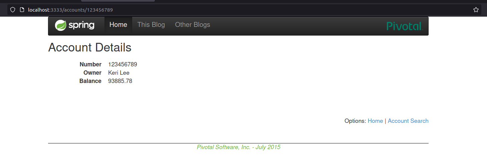

This is working over the account we have launched before.
Now the registration service has these two services registered, and we can see it on the web browser at port 1111, there have appeared two services that we can see at the next figure.

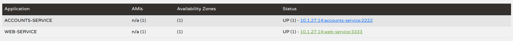

If we click on the status column we can see information about the services:

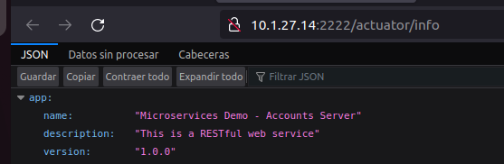

Now we are going to stop the account service.

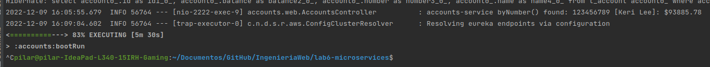

We can see on the web browser that the web service is not working now, That’s beacause it is looking for a service that is not working any more.

Next, we are going to launch again the account service in another port (4000). 

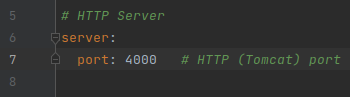

After that, we change again the port (4004) and launch another account service.

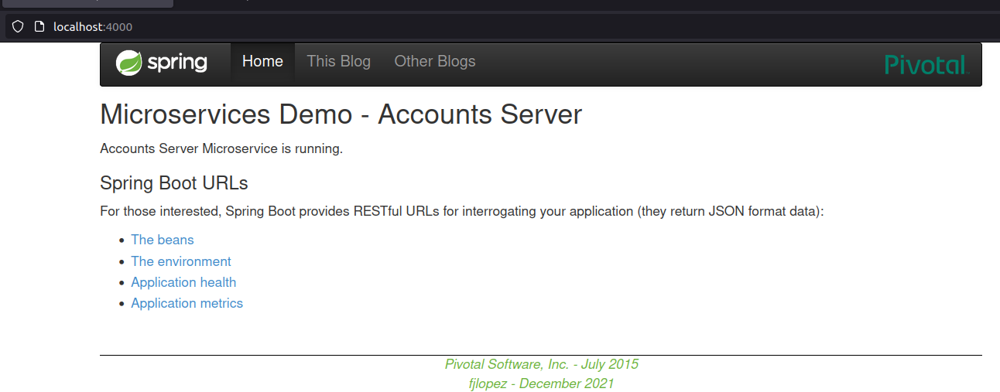

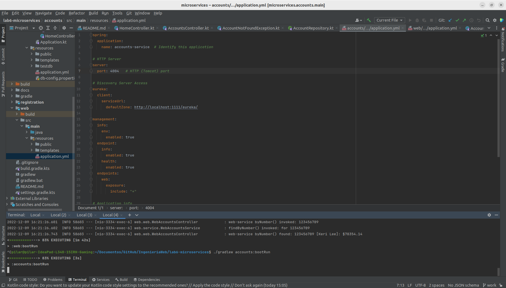

Now we can recharge the web browser and see it is working again.

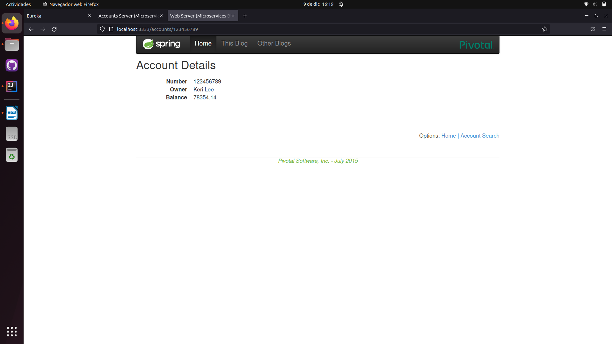

If we launch another web service in another port, it will connect to one of the account services.

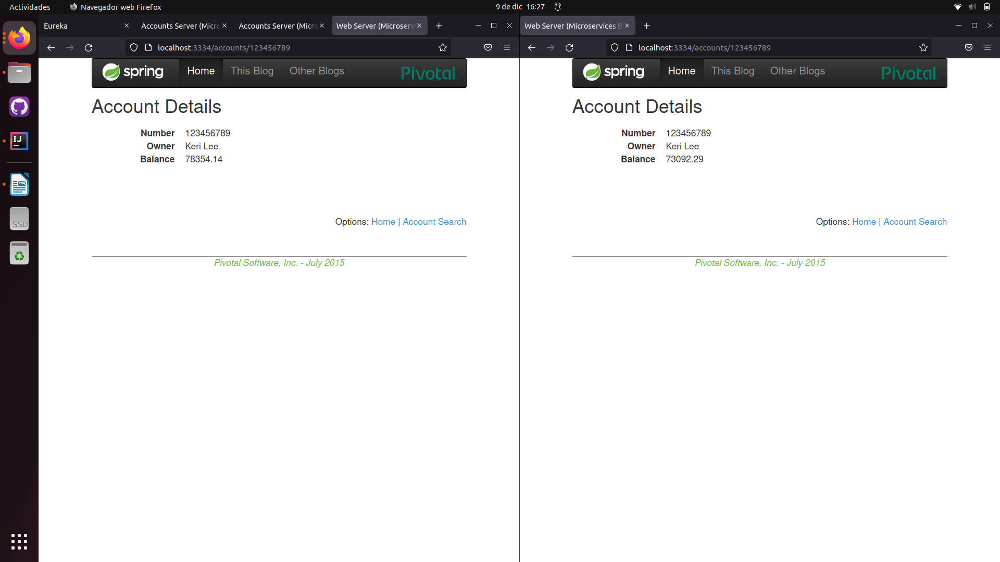

When we stop an account serrvice, as in this case each web is connected to one different account, one of the web services will stop working for a while, and then will try to connect to the other account service and start working again.

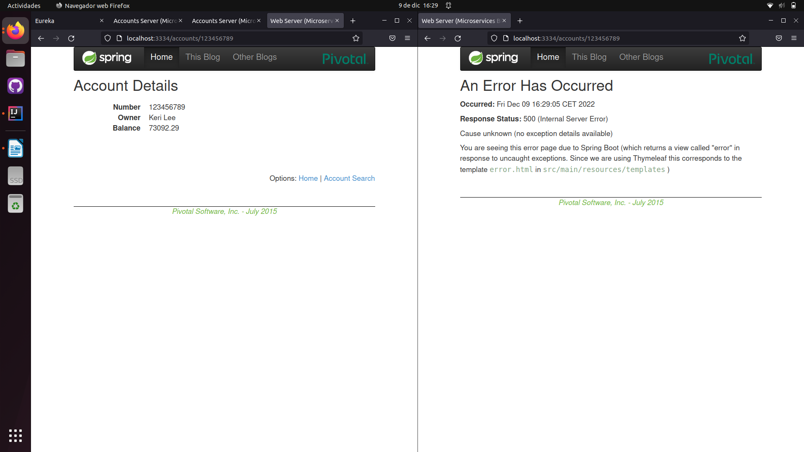

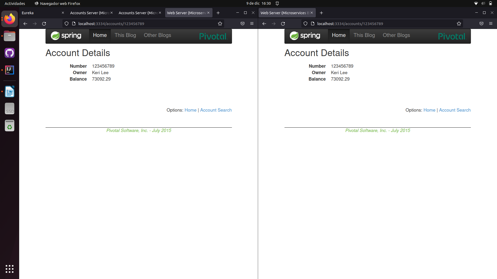
